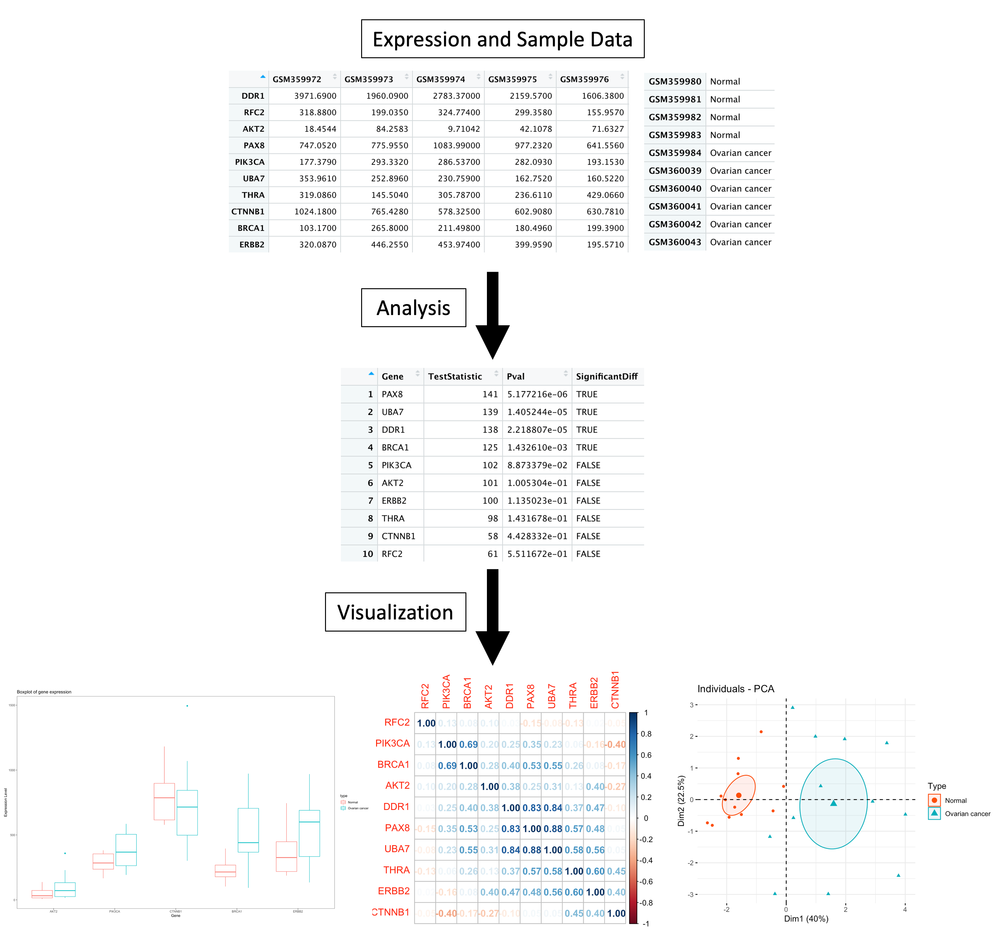

# expressionAnalysis

## Description

`expressionAnalysis` is an R package aiming at identifying potential
biomarkers in a specific disease by analyizing gene expression data. It
aims at making the process of computing and visualising the data more
accessible and efficient. <br> <br> The `expressionAnalysis` package was
developed using `R version 4.2.1 (2022-06-23)`,
`Platform: x86_64-apple-darwin17.0` and
`Running under: macOS Ventura 13.0.1`.

## Installation

To install the latest version of the package:

``` r
require("devtools")
devtools::install_github("ari-beau/expressionAnalysis", build_vignettes = TRUE)
library("expressionAnalysis")
```

To run the Shiny app: Under construction

## Overview

``` r
ls("package:expressionAnalysis")
data(package = "expressionAnalysis") 
browseVignettes("expressionAnalysis")
```

`expressionAnalysis` contains 4 functions to analyze gene expression
data. The *exprNormalization* function normalizes expression data, using
different methods including total count normalization, log2
transformation and standardization. The*correlationPlot* function
calculates the pairwise correlation between genes, and produces a
correlation plot to for visualization. The *rankDEG* function uses
different methods, including t-test and Wilcoxon rank sum test, to rank
differentially expressed genes between case samples and control samples.
The *exprPlot* produces boxplots to visualize differential gene
expression.

The package also contains two datasets from a gene expression profiling
experiment in ovarian cancer, called *OVExpression* and *OVSample.*

An overview of the package is illustrated below.



## Contributions

The author of the package is Arianne Beauregard. The *exprNormalization*
function makes use of the `dplyr` R package. The *correlationPlot*
function uses the `corrplot` R package to produce a pairwise correlation
plot of genes. The *rankDEG* function uses different methods to rank
differential gene expression. The *exprPlot* function uses the function
*melt* from the `reshape` R package to reshape the expression dataframe.
It also uses the `ggplot2` package to produce the boxplot. <br> <br> The
datasets *OVSample* and *OVExpression* are from ovarian cancer gene
expression profiling experiment (Bowen N.J. et al., 2009).

## References

Bowen, N. J., Walker, L. D. E., Matyunina, L. V., Logani, S., Totten, K.
A., Benigno, B. B., & McDonald, J. F. (2009). Gene expression profiling
supports the hypothesis that human ovarian surface epithelia are
multipotent and capable of serving as ovarian cancer initiating cells.
*BMC Medical Genomics*, 2(1). <https://doi.org/10.1186/1755-8794-2-71>

Wei T, Simko V (2021). R package ‘corrplot’: Visualization of a
Correlation Matrix. (Version 0.92),
<https://github.com/taiyun/corrplot>.

Wickham H, François R, Henry L, Müller K (2022). dplyr: A Grammar of
Data Manipulation. <https://dplyr.tidyverse.org>,
<https://github.com/tidyverse/dplyr>.

Wickham H (2016). ggplot2: Elegant Graphics for Data Analysis.
Springer-Verlag New York. ISBN 978-3-319-24277-4,
<https://ggplot2.tidyverse.org>.

Wickham H (2007). “Reshaping data with the reshape package.” Journal of
Statistical Software, 21(12). <https://www.jstatsoft.org/v21/i12/>.

## Acknowledgements

This package was developed as part of an assessment for 2022 BCB410H:
Applied Bioinformatics course at the University of Toronto, Toronto,
CANADA. `expressionAnalysis` welcomes issues, enhancement requests, and
other contributions. To submit an issue, use the [GitHub
issues](https://github.com/ari-beau/expressionAnalysis/issues).
